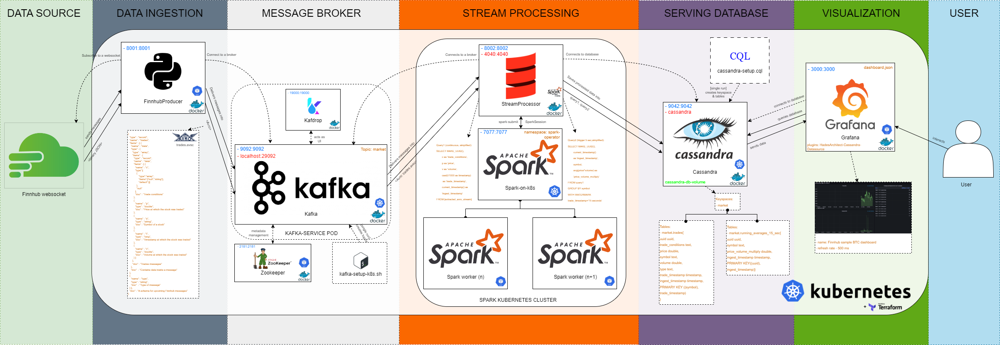
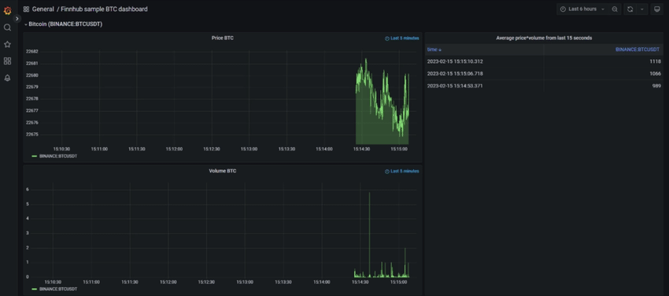

# 📡 Finnhub Streaming Data Pipeline

A **real-time stock data streaming pipeline** built using **Python**, **Kafka**, **Apache Spark**, **Cassandra**, **Plotly Dash**, and **Grafana**, deployed via **Kubernetes**, **Docker**, and **Terraform**. This project was developed as part of my **master's thesis** focused on **stream processing and distributed data pipelines**.

It demonstrates how to build an **end-to-end streaming architecture** with low latency, horizontal scalability, high availability, and real-time dashboard visualization using stock trading data from the [Finnhub API](https://finnhub.io/).

---

## 🧠 Project Overview

This project simulates a **real-time stock market monitoring system**, streaming data from **Finnhub WebSocket API**, processing it via **Apache Spark Structured Streaming**, storing it in **Apache Cassandra**, and finally visualizing it with **Grafana dashboards**.

All microservices are **containerized with Docker**, orchestrated with **Kubernetes**, and managed using **Terraform** for infrastructure-as-code.

---

## ⚙️ Architecture Overview


### 🔸 Components:

- **🔁 Data Ingestion (Producer)**
  - Python-based app connects to Finnhub WebSocket API
  - Converts messages to Avro format (as per `schemas/trades.avsc`)
  - Streams data to Kafka broker

- **📩 Message Broker**
  - Kafka broker deployed in Kubernetes pod
  - Kafdrop sidecar container for Kafka UI
  - Topics initialized via `kafka-setup-k8s.sh`
  - Zookeeper for Kafka metadata

- **⚡ Stream Processing**
  - Spark Structured Streaming app written in Scala
  - Runs on Spark-on-Kubernetes via Helm (`spark-k8s-operator`)
  - Transforms and aggregates real-time trades
  - Writes to Apache Cassandra

- **🗄️ Serving Layer**
  - Cassandra stores processed data
  - Schema and tables initialized with `cassandra-setup.cql`

- **📊 Visualization Layer**
  - Grafana with [Cassandra plugin](https://github.com/HadesArchitect/GrafanaCassandraDatasource)
  - Dashboard updates every 500ms
  - Can be accessed via `kubectl port-forward`

---

## 📈 Dashboard Preview

 <!-- Optional: replace with your own cropped preview gif -->

> Access the dashboard at `http://localhost:3000` after port-forwarding Grafana:
```bash
kubectl port-forward -n pipeline service/grafana 3000:3000
```

---

## 🚀 Deployment Instructions

This pipeline is designed to run on **Minikube (local Kubernetes cluster)**, but can be easily adapted for **EKS, GKE, or AKS** by updating provider-specific settings.

### Prerequisites

- Docker Desktop
- Minikube
- Helm
- Terraform
- PowerShell (for Windows)

### Environment Variables

Before running, set proxy and Docker environment (optional if behind proxy):

```powershell
set HTTP_PROXY=http://<proxy>
set HTTPS_PROXY=https://<proxy>
set NO_PROXY=localhost,127.0.0.1,...
```

### Start Minikube

```powershell
minikube start --no-vtx-check --memory 10240 --cpus 6
```

### Setup Docker Env

```powershell
minikube docker-env | Invoke-Expression
```

### Build and Deploy

```powershell
docker-compose -f docker-compose-ci.yaml build --no-cache
cd terraform-k8s
terraform apply
```

### API Keys

Update `terraform-k8s/config.tf` with:

- ✅ Your **Finnhub API Token**
- 🔐 Cassandra username/password

---

## 🧪 Technologies Used

| Layer               | Tools / Technologies                                       |
|--------------------|------------------------------------------------------------|
| Data Ingestion      | Python, WebSocket, Avro                                    |
| Messaging           | Apache Kafka, Kafdrop, Zookeeper                          |
| Stream Processing   | Apache Spark, Scala, Spark Structured Streaming            |
| Storage             | Apache Cassandra                                           |
| Visualization       | Grafana, Grafana-Cassandra Plugin                          |
| Infrastructure      | Docker, Kubernetes, Helm, Terraform                        |
| Deployment          | Minikube, Docker Compose (legacy support)                 |

---

## 🧰 Potential Improvements

Here are some improvements I plan to explore in the future:

- 🔄 **Fix Spark Operator**: The Google-hosted image was removed; needs replacement
- ☁️ **Deploy on Cloud**: Migrate to EKS/GKE for scalability
- 🧪 **Add CI/CD**: Setup CI/CD pipeline for Kubernetes & Terraform
- 📊 **Alternative Visualization**: Explore Apache Superset or Streamlit
- 🚥 **StatefulSets for Kafka/Cassandra**: Improve stability and resilience
- 🌐 **Web UI for Cassandra**: Add a Cassandra web viewer
- 📦 **Refactor Docker Volumes**: Use `volumeMounts` over copying files into images

---

## 📘 Legacy Support

A `docker-compose-old` branch exists for those wanting to run the pipeline outside of Kubernetes (not recommended for production).

---

## 📄 License

This project is open-source and intended for **educational and personal development purposes**.